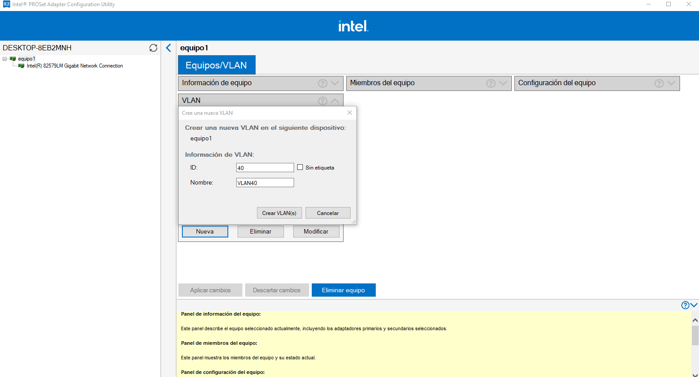
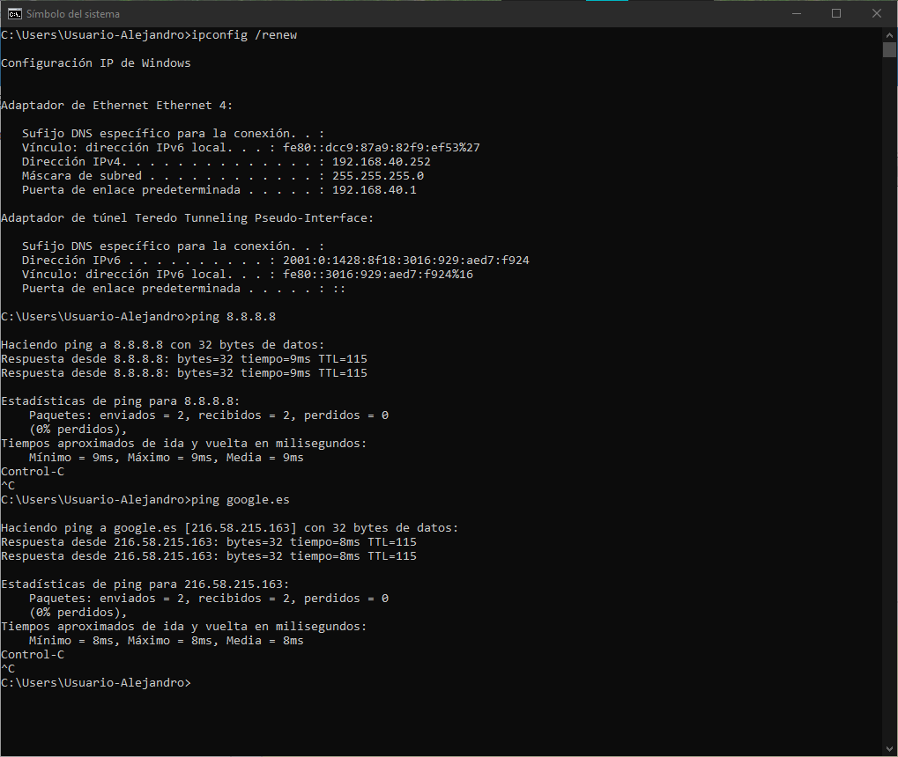

# Índice

1. [Introducción📕](#1-introducción)
2. [Descripción de las tecnologías🖥️](#2-descripción-de-las-tecnologías)
   - [2.1 MikroTik (RouterOS)](#21-mikrotik-routeros)
   - [2.2 VyOS](#22-vyos)
3. [Esquema de red🌐](#3-esquema-de-red)
4. [Instalación⏬](#4-instalación)
   - [4.1 Vyos](#41-vyos)
   - [4.2 RouterOS (Mikrotik)](#42-routeros-mikrotik)
   - [4.3 ¿Cuál me parece más cómodo de instalar?](#43-cuál-me-parece-más-cómodo-de-instalar)
5. [Acceso remoto📶](#5-acceso-remoto)
6. [Configuración básica🛠️](#6-configuración-básica)
   - [6.1 Configuración de interfaces](#61-configuración-de-interfaces)
   - [6.2 VLANs](#62-vlans)
7. [Configuraciones avanzadas](#7-configuraciones-avanzadas)
   - [Firewall](#firewall)
   - [NAT](#nat)
   - [Enrutamiento BGP](#enrutamiento-bgp)
   - [Enrutamiento OSPF](#enrutamiento-ospf)
8. [VRRP (Failover)](#8-vrrp-failover)
9. [WireGuard VPN📶](#9-wireguard-vpn)
10. [Autenticación usando RADIUS☢️](#10-autenticación-usando-radius)
11. [Comparación general ⏹️](#11-comparación-general)
12. [Conclusiones🔚](#12-conclusiones)
13. [Bibliografía y recursos 📚](#13-bibliografía-y-recursos)

# 1. Introducción📕

En el contexto actual de redes informáticas, la elección de dispositivos y plataformas para el enrutamiento y gestión del tráfico adquiere una importancia crítica. La diversidad de soluciones disponibles permite a los administradores de sistemas adaptar sus infraestructuras a diferentes necesidades, tanto técnicas como económicas. En este trabajo fin de grado (TFG) se presenta una comparativa práctica entre dos soluciones ampliamente utilizadas en entornos profesionales y educativos: MikroTik y VyOS.

El objetivo principal de este proyecto es comparar ambas plataformas desde el punto de vista de la complejidad de configuración, abordando distintas funcionalidades clave en la administración de redes como la creación de VLANs, reglas de firewall, NAT, protocolos de enrutamiento dinámico (BGP), túneles VPN (WireGuard e IPsec), automatización y alta disponibilidad. Para ello se ha diseñado una topología de red común, implementada por separado con cada tecnología, documentando todo el proceso.

Este trabajo permitirá no solo entender las capacidades de cada sistema, sino también ofrecer una visión clara sobre cuál puede ser más adecuado según el contexto o perfil técnico del administrador. Asimismo, pretende servir como guía práctica para estudiantes de ASIR y profesionales que deseen profundizar en estas herramientas.

---
# 2. Descripción de las tecnologías🖥️

### 2.1 <u>MikroTik (RouterOS)</u>

MikroTik es una empresa letona especializada en hardware y software para redes. Su sistema operativo, **RouterOS**, es conocido por ofrecer una amplia gama de funcionalidades profesionales con un coste reducido, lo que lo convierte en una opción muy popular en PYMEs, ISP y entornos educativos.

RouterOS puede ser administrado de diversas formas: mediante línea de comandos (CLI), acceso web o a través de **Winbox**, una herramienta gráfica que simplifica la gestión del sistema. Esto hace que sea accesible tanto para usuarios avanzados como para quienes prefieren un entorno visual.

Entre sus características más destacadas se encuentran el soporte de protocolos de enrutamiento como OSPF y BGP, herramientas de gestión de tráfico (QoS), firewalls avanzados, túneles VPN y un potente sistema de scripting para automatizar tareas.

### 2.2 <u>VyOS</u>

VyOS es una distribución de red basada en Linux, de código abierto, que convierte un ordenador o máquina virtual en un router y firewall completamente funcional. Es el sucesor del desaparecido Vyatta y se caracteriza por tener un sistema de configuración estructurado y centralizado, similar al de equipos de alto nivel como Juniper o Cisco.

VyOS se administra completamente a través de la **interfaz de línea de comandos (CLI)**, con una sintaxis clara y orientada a bloques de configuración. Esta aproximación obliga al administrador a tener un conocimiento más profundo del sistema, pero a cambio proporciona un control total y una mayor claridad en la documentación y automatización de la configuración.

VyOS ofrece soporte para múltiples protocolos y servicios de red como NAT, firewalls, OSPF, BGP, IPsec, WireGuard, VRRP, y permite una fácil integración con herramientas de automatización como Ansible o scripts en Bash.

---
# 3. Esquema de red🌐


---
# 4. Instalación⏬

## <u>Vyos</u>

Para instalar VyOS, primero nos pide un usuario y una contraseña, por defecto, vyos/vyos.

A continuación, escribimos el siguiente comando:

```python
install image
```


Nos hace varias preguntas como que contraseña queremos para el usuario vyos, que tipo de consola queremos usar, en que disco duro, etc...


Una vez instalado, escribimos ```reboot``` y reiniciamos.
## <u>RouterOS (Mikrotik)</u>

Este es más sencillo, pues es solo una OVA que se puede descargar en su [página web](https://mikrotik.com/download) que tiene abajo un apartado llamado "Cloud Hosted Router".


Simplemente editamos los campos que queramos y le damos a "Terminar".

### 4.1 ¿Cuál me parece más cómodo de instalar?

✅Mikrotik por su sencillez al ser una OVA.

---
# 5. Acceso remoto📶

## <u>VyOS</u>

Por defecto, VyOS no coge IP, así que se lo tenemos que poner manualmente a través de un comando:

```python
configure
set interfaces ethernet eth0 address dhcp
commit
save
```

Primero tenemos que entrar en modo configuración y luego decirle a la interfaz eth0 que obtenga IP por DHCP. Después ponemos **commit** y **save**
para aplicar los cambios y vemos si ha obtenido IP.


Observamos que tiene la IP 192.168.1.50, intentamos conectarnos por SSH.


> [!CAUTION] 
Nos deniega la conexión, ahora vamos a activarlo.


Estando en modo configuración, escribimos el comando:
```python
set service ssh
commit
save
```

Guardamos y aplicamos cambios, volvemos a probar SSH.


> [!tip] 
Vemos que ya tenemos acceso.

---
## <u>Mikrotik</u>

Una vez que hemos iniciado la máquina virtual, abrimos la aplicación Winbox de Mikrotik, nos vamos al apartado **Neighbors** y seleccionamos nuestro router.


Lo podemos identificar por la MAC.


Por defecto, para entrar a un router Mikrotik, el usuario es admin y la contraseña en blanco, ya que después de entrar te pide cambiar la contraseña.


Ahora intentamos acceder por SSH a nuestro router Mikrotik, normalmente, viene activado y no hace falta ninguna configuración adicional.


> [!warning]
> SSH en Mikrotik se va a usar poco o nada ya que con la aplicación Winbox lo puedes hacer todo de manera gráfica.

---
# 6. Configuración básica🛠️

La configuración básica va a ser bastante sencilla pues va a ser solo asignar IP a las interfaces, crear las VLANs y poner una ruta estática para asegurar la salida a internet.

En este apartado vamos a hacer lo siguiente:
- Establecer IPs en las interfaces necesarias.
- Crear VLANs.
- Poner las rutas estáticas necesarias.

## 6.1 Configuración de interfaces
### <u>VyOS</u>

En la configuración de antes, a nuestra interfaz **eth0** le hemos asignado DHCP para poder hacer la prueba de acceder por SSH, en realidad, eso es bastante poco práctico, vamos a asignarle una IP estática:

```python
set interfaces ethernet eth0 address '192.168.1.50/24'
commit
save
```


Y eliminamos la configuración DHCP
```python
delete interfaces ethernet eth0 address dhcp
commit
save
```


Ya no pone DHCP como antes:


### <u>Mikrotik</u>

Vamos a IP > Addresses.


Podemos ver que a la izquierda tiene una D que significa dinámico, vamos a ponerlo estático.

Primero lo que hacemos es añadir IP a otra interfaz (por si acaso perdemos acceso) y eliminar la IP de ether1 dándole al "-" rojo. Una vez hecho eso nos sacará del router, normalmente se puede acceder por MAC:


Como podemos ver arriba donde pone "Session" está la MAC de la máquina virtual. También está la IP de la interfaz que hemos configurado por si perdíamos acceso, pues ahora cambiamos la IP y la interfaz para que sea la ether1 (que es la que sale a internet y puede actuar como puente).

Le damos doble click y completamos la configuración, importante poner la máscara de red para que se autorrellene el campo de Network.


Le damos a "Apply" y "Ok".


Ya tenemos la IP estática.

## 6.2 VLANs

> [!note]
¿Qué son las VLAN?

> Las VLAN (Redes de Área Local Virtuales) son una forma de dividir una red física en varias redes lógicas independientes. Esto significa que, aunque todos los dispositivos estén conectados al mismo switch/router físico, pueden agruparse como si estuvieran en redes separadas, lo que mejora la seguridad, el rendimiento y la organización.

Estas configuraciones las vamos a hacer de 2 maneras diferentes para que se vea las distintas configuraciones. En una de ellas (la 1ª) hay un problema, normalmente, los equipos no etiquetan las VLANs por defecto, por lo que si conectamos directamente el equipo al router, no va a saber a que VLAN tirar, por lo que la conexión se queda directamente en la interfaz, pero hay algunos trucos para sortear ese problema, lo veremos más tarde.
### <u>VyOS</u>

#### <u>1er método</u>


<div class="page-break" style="page-break-before: always;"></div>


```python
conf # Entramos en modo configuración.

set interfaces ethernet eth1 vif 10 address 192.168.10.1/24 # Creamos VLAN 10 en la interfaz eth1 con la IP 192.168.10.1/24.

set service dhcp-server shared-network-name VLAN10 subnet 192.168.10.0/24 option default-router 192.168.10.1 # Creamos el servidor DHCP y definimos el router por defecto de la red en 192.168.10.1.

set service dhcp-server shared-network-name VLAN10 subnet 192.168.10.0/24 range 0 start 192.168.10.100 # Definimos el principio del rango de IPs a repartir en el rango 0. Ese número tiene que ser único en cada rango.

set service dhcp-server shared-network-name VLAN10 subnet 192.168.10.0/24 range 0 stop 192.168.10.150 # Definimos el final del rango de IPs a repartir en el rango 0. Ese número tiene que ser único en cada rango.

set service dhcp-server shared-network-name VLAN10 subnet 192.168.10.0/24 option name-server 8.8.8.8 # Definimos los DNS de ese server DHCP.

set service dhcp-server shared-network-name VLAN10 subnet 192.168.10.0/24 subnet-id 1 # Definimos el ID de la subred.

commit # Aplicamos cambios

save # Guardamos
```

>[!note]
En VyOS, las VLANs son vistas de la siguiente manera:

Si creamos una **VLAN** en la interfaz eth1, por ejemplo, la VLAN10 y en `vif` le decimos 10, crearía como una **subinterfaz** dentro de eth1 que se llamaría eth1.10.

#### <u>Permitir salida a internet</u>


```python
config

set nat source rule 100 outbound-interface name eth0 # Le decimos a la regla NAT que salga por la interfaz eth0

set nat source rule 100 source address 0.0.0.0/0 # Decimos que permita todo lo que entre

set nat source rule 100 translation address masquerade # Decimos que enmascare la conexión

commit

save

```

>[!note] 
**¿Qué necesitamos hacer ahora en Proxmox?**
>Tenemos que ir a las opciones de Network en nuestro contenedor de Proxmox y en VLAN Tag, decirle el ID de la VLAN que creamos anteriormente, que era el número 10.

>[!note]
**¿Por qué lo hemos hecho en Proxmox?**
>Para que un dispositivo final —en este caso, nuestro Debian— sepa a qué VLAN pertenece su tráfico, es necesario **"etiquetar" (taggear)** dicho tráfico. Esto significa que, dependiendo del **puerto del switch al que esté conectado**, el switch puede **añadir una etiqueta VLAN** (por ejemplo, VLAN 10) al tráfico que proviene del dispositivo.
>
Por ejemplo:  
Todo lo que llegue por el **puerto 2** del switch pertenece a la **VLAN 10**. El switch entonces **etiqueta automáticamente** ese tráfico con el identificador de VLAN 10.
>
>Esto se hace porque, por defecto, **los dispositivos finales (como PCs o servidores)** no manejan VLANs ni saben a cuál VLAN pertenece su red. Por eso, **es el switch el que lo hace por ellos**. Para ello, necesitas un **switch gestionable que soporte VLANs** —los switches básicos no tienen esta funcionalidad.
>
En entornos virtualizados, como en nuestro caso, el **"switch gestionable" sería el propio Proxmox**, que puede simular el comportamiento de un switch físico y asignar etiquetas VLAN según la configuración de sus bridges o vNICs.
>
También es importante saber que **VyOS puede etiquetar tráfico (taggear VLANs)**, lo veremos en el segundo ejemplo.
>
En este primer caso **no se está etiquetando el tráfico** porque estamos usando **VLANs directamente sobre interfaces físicas**, lo que implica que VyOS espera **tráfico ya etiquetado** desde el exterior. Es decir, VyOS no está aplicando etiquetas, solo las entiende y enruta.


> [!tip] 
Como podemos ver, el cliente recibe IP y sale a internet

### <u>Mikrotik</u>

La creación y configuración de VLANs en Mikrotik es relativamente sencillo al ser un entorno gráfico.

Este método consiste en simplemente, aplicar las VLANs directamente en las interfaces en vez de crear un puente y meter todas ahí, que es lo que haremos en el 2º método.

Nos vamos a la interfaz, le damos click derecho>Add>VLAN.


Aquí simplemente rellenamos la información necesaria, Name, VLAN ID e Interface. Le damos a Apply y a Ok.


Ahora, nos vamos a IP > Addresses y le asignamos IP a VLAN40.


Ahora creamos el servidor DHCP.
Le damos a DHCP Setup para una fácil creación.


#### <u>Permitir salida a internet</u>
Para permitir la salida a internet en estos casos, hay que aplicar NAT:

Nos vamos a IP>Firewall>NAT>+


Rellenamos los campos necesarios:
* **Chain:** Ponemos srcnat.
* **Src. Address:** Ponemos 0.0.0.0/0 para que entre todo.
* **Out.Interface:** Ponemos ether1 porque es la WAN.

Ahora en action ponemos masquerade.


> Así podrá salir a internet.

Ahora viene la parte "complicada" de este método, que el equipo sepa ir a la VLAN y el servidor DHCP le asigne IP.

>[!note]
**¿Qué he tenido que hacer?** 
>Para poder decirle a la tarjeta de red a que VLAN ir, he tenido que instalar un driver llamado [Intel® Ethernet Adapter Complete Driver Pack](https://www.intel.com/content/www/us/en/download/15084/intel-ethernet-adapter-complete-driver-pack.html) el cual tiene un software que te permite asignar la VLAN. Una vez instalado, abrimos el programa como administrador y nos vamos a Equipos/VLAN. Hay una pestaña llamada VLAN dentro, le damos a Nueva y ponemos el VLAN ID asignado anteriormente a la VLAN.

>[!note] 
**¿Por qué lo he tenido que hacer?**
>Esto es lo mismo que expliqué anteriormente en el apartado de VyOS, el dispositivo final por si solo no sabe a que VLAN ir, y como no tenemos un switch gestionable de por medio, usamos un software.
>
>Este software permite que le digamos a la tarjeta de red que ID de VLAN es la que nos pertenece, y es por exactamente lo mismo, una VLAN sobre una interfaz física no puede taggear automáticamente el tráfico.






Y eso sería toda la configuración de una VLAN directamente sobre una interfaz.

#### <u>2º Método</u>

Este método consiste en centralizar todas las VLANs en un solo bridge y activar el VLAN Filtering para controlar qué VLANs pueden pasar por cada puerto del bridge.

No he conseguido reproducir este mismo ejemplo exactamente como en Mikrotik en **VyOS** ya que obviamente los 2 no tienen las mismas opciones ni el mismo diseño. Pero he conseguido algo muy similar y es prácticamente lo mismo.

| Característica                            | VLANs sobre interfaz física     | VLANs en bridge con `vlan-filtering` |
| ----------------------------------------- | ------------------------------- | ------------------------------------ |
| **Uso típico**                            | Laboratorios, pruebas simples   | Producción, entornos complejos       |
| **Flexibilidad**                          | Limitada a una interfaz         | Alta: múltiples puertos y WiFi       |
| **Soporte para WiFi/CAPsMAN**             | No                              | Sí, totalmente compatible            |
| **Gestión centralizada de VLANs**         | No                              | Sí, con `/interface bridge vlan`     |
| **Escalabilidad**                         | Baja                            | Alta                                 |
| **Compatibilidad con access/trunk ports** | No                              | Sí, con `pvid` y `tagged/untagged`   |
| **Control de aislamiento y errores**      | Menos control, riesgo de mezcla | Más preciso, mejor aislamiento       |
### <u>VyOS</u>


Comprobamos que no tenemos ninguna interfaz extra ya que podría dar fallo.

Ahora, nos metemos en modo configuración e insertamos todos los comandos siguientes:

```python
set interfaces bridge br0 # Creamos el bridge llamado br0

set interfaces bridge br0 enable-vlan # Le habilitamos el soport para VLAN

set interfaces bridge br0 member interface eth1 # Añadimos eth1 a br0
set interfaces bridge br0 member interface eth2
set interfaces bridge br0 member interface eth3

set interfaces bridge br0 vif 10 address 192.168.10.1/24
set interfaces bridge br0 vif 30 address 192.168.30.1/24
set interfaces bridge br0 vif 20 address 192.168.20.1/24

set interfaces bridge br0 member interface eth1 native-vlan 10 # Este comando hace que todo el tráfico no etiqueado que entre por el puerto eth1 se asigne automáticemente a la VLAN 10, es decir, el puerto se configura en modo access

set interfaces bridge br0 member interface eth2 native-vlan 20
set interfaces bridge br0 member interface eth3 native-vlan 30

set service dhcp-server shared-network-name VLAN10 subnet 192.168.10.0/24 subnet-id 10

set service dhcp-server shared-network-name VLAN10 subnet 192.168.10.0/24 option default-router 192.168.10.1

set service dhcp-server shared-network-name VLAN10 subnet 192.168.10.0/24 option name-server 8.8.8.8

set service dhcp-server shared-network-name VLAN10 subnet 192.168.10.0/24 range 0 start 192.168.10.100

set service dhcp-server shared-network-name VLAN10 subnet 192.168.10.0/24 range 0 stop 192.168.10.200

set service dhcp-server shared-network-name VLAN20 subnet 192.168.20.0/24 subnet-id 20

set service dhcp-server shared-network-name VLAN20 subnet 192.168.20.0/24 option default-router 192.168.20.1

set service dhcp-server shared-network-name VLAN20 subnet 192.168.20.0/24 option name-server 8.8.8.8

set service dhcp-server shared-network-name VLAN20 subnet 192.168.20.0/24 range 0 start 192.168.20.100

set service dhcp-server shared-network-name VLAN20 subnet 192.168.20.0/24 range 0 stop 192.168.20.200

set service dhcp-server shared-network-name VLAN30 subnet 192.168.30.0/24 subnet-id 30

set service dhcp-server shared-network-name VLAN30 subnet 192.168.30.0/24 range 0 start 192.168.30.100

set service dhcp-server shared-network-name VLAN30 subnet 192.168.30.0/24 range 0 stop 192.168.30.200

set service dhcp-server shared-network-name VLAN30 subnet 192.168.30.0/24 option default-router 192.168.30.1

set service dhcp-server shared-network-name VLAN30 subnet 192.168.30.0/24 option name-server 8.8.8.8

commit

save
```

>[!note]
¿Qué es un puerto en modo access?
>Un **puerto en modo access** es un puerto configurado para conectarse a una sola VLAN y no usa etiquetas especiales en los paquetes. Esto significa que todo el tráfico que entra o sale por ese puerto pertenece siempre a esa VLAN específica, sin que los dispositivos conectados tengan que saber nada sobre VLANs. Es el modo ideal para ordenadores, impresoras u otros dispositivos comunes que no entienden de redes VLAN.


Una vez insertada la pila de comandos y habiendo hecho commit y save para que se guarden los cambios, volvemos atrás para observar si todo se ha creado correctamente. Vemos que tenemos 3 VLANs que se han creado en el puente y que a través de los comandos anteriores, hemos asociado a cada puerto físico.


Si ponemos el comando ```show bridge br0``` vemos las interfaces añadidas al bridge.

> [!tip] 
Y en la imagen de abajo vemos que la máquina virtual, al solicitar IP, ya que está conectada a la red interna llamada **interna1**, recibirá la IP de la red **192.168.10.0/24**.


>[!note]
A diferencia del método anterior, este enfoque **no requiere configurar manualmente en el dispositivo final a qué VLAN pertenece**. En su lugar, el sistema **determina automáticamente la VLAN** en función del **puerto físico al que se conecta**, como se indica en el siguiente comando:
>
>
`set interfaces bridge br0 member interface eth1 native-vlan 10`
>
Este comando se aplica **dentro de un bridge VLAN-aware**, y le dice a VyOS que **todo el tráfico no etiquetado que entre por `eth1` se asigne a la VLAN 10**.
>
Es importante aclarar que este comando **no es aplicable a interfaces físicas configuradas directamente con VLANs (`vif`)**, sino que se usa **cuando todas las VLANs se gestionan desde un bridge** que es consciente de VLANs (VLAN-aware).
>
El mismo concepto se aplica en Mikrotik, aunque la implementación sea diferente.

### <u>Mikrotik</u>


Lo primero que vamos a hacer en Mikrotik va a ser ir a Interfaces > + > Bridge.


Vamos a llamarle simplemente "bridge1"

Ahora nos vamos al apartado **VLAN** y activamos VLAN Filtering

Ahora le damos a Apply y a OK.

> [!important]
> El **VLAN filtering** en MikroTik es una función que permite al bridge manejar el tráfico VLAN de forma inteligente, es decir, puede etiquetar, des-etiquetar y separar el tráfico por VLAN directamente en el bridge sin necesidad de usar interfaces VLAN independientes. Al activarlo, puedes definir qué puertos del bridge aceptan o envían tráfico de ciertas VLANs (modo _access_ o _trunk_), lo que permite segmentar la red de forma segura y eficiente directamente desde el switch integrado del router.
>
>Es decir, si no activamos **VLAN Filtering**, Mikrotik actúa como si fuera un simple switch, no segmentaría ni separaría las distintas VLAN y mezclaría todo el tráfico.

Ahora, en el mismo apartado de Interface, buscamos la categoría VLAN y le damos al + para crearla.


Teniendo en cuenta lo que está en azul, cambiamos el nombre de la VLAN para que sea VLAN10, el VLAN ID también lo cambiamos al número que queramos, en mi caso 10, y cambiamos Interface a el bridge que hemos creado antes. Le damos a Apply y a Ok.

Ahora, en la barra de la izquierda, nos vamos hacia Bridge > Ports > +


Insertamos la interfaz física que queramos asignar a la VLAN 10 al bridge creado anteriormente y después nos vamos a la pestaña VLAN.


Aquí simplemente, en PVID, insertamos la VLAN ID que le pusimos anteriormente a la VLAN.


Ahora, vamos a IP > Addresses > + y le asignamos IP a la VLAN.


Seguidamente, como vimos anteriormente, creamos el servidor DHCP para esa VLAN.


Ahora renovamos IP en el equipo cliente que está conectado **directamente** por cable al router Mikrotik en el puerto ethernet1 y vemos que nos da perfectamente una IP.


En Mikrotik, en DHCP Server > Leases, también vemos perfectamente que se le ha asignado al equipo.

---
# 7. Configuraciones avanzadas

Aunque no son avanzadas como tal, sí que son un poco más complejas y completas ya que requieren un poco más de entendimiento del propio sistema.

## Firewall

>[!note]
¿Qué es un Firewall?
> Un firewall en un router es una herramienta de seguridad que controla qué datos pueden entrar o salir de la red, bloqueando accesos no autorizados y permitiendo solo el tráfico confiable según las  reglas definidas.

### <u>VyOS</u>

Vamos a hacer algo fácil primero, vamos a permitir el tráfico de FTP y SSH pero vamos a bloquear el acceso por Telnet.


```python
set firewall ipv4 name WAN default-action drop # Por defecto, a menos que se diga lo contrario, todo se dropea, es decir, no pasa el tráfico

set firewall ipv4 name WAN rule 10 action accept # Esta regla indica que lo que vamos a especificar es para aceptar el tráfico

set firewall ipv4 name WAN rule 10 description 'Permitir SSH' # Agregamos una restricción a la regla

set firewall ipv4 name WAN rule 10 protocol tcp # Le decimos que protocolo va a usar

set firewall ipv4 name WAN rule 10 destination port 22 # Le decimos que el puerto permitido es el 22

commit

save
```


```python
set firewall ipv4 name WAN rule 30 action drop

set firewall ipv4 name WAN rule 30 description 'Bloqueamos Telnet'

set firewall ipv4 name WAN rule 30 protocol tcp

set firewall ipv4 name WAN rule 30 destination port 23

commit

save
```

```python
set firewall ipv4 name WAN rule 10 inbound-interface name eth0 # Especifica que la regla 10 se aplicará solo al tráfico entrante en la interfaz eth0

set firewall ipv4 name WAN rule 30 inbound-interface name eth0
```

Vamos a comprobarlo, desde un contenedor Debian 12 voy a intentar conectarme por SSH y Telnet.


> [!tip] 
Como podemos observar, me deja perfectamente, vamos ahora con Telnet.


> [!tip] 
Perfecto, lo rechaza.

### <u>Mikrotik</u>

Para hacerlo en Mikrotik es más sencillo, nos vamos a IP > Firewall > Filter Rules > +.


* **Chain: input.** En este caso es Input porque el tráfico termina en el router.
* **Protocol: 6 (tcp).** Protocolo TCP.
* **In. Interface: ether1.** La interfaz por la que va a venir el tráfico es la ether1.

* **Action:** accept. Aceptamos ese tráfico.


> [!tip] 
Podemos acceder, ahora probamos a deshabilitarla.


> [!tip] 
Vemos que se queda pensando y no entramos.

Ahora seguimos casi el mismo procedimiento para Telnet, cambiamos el puerto por el 23 y en Action ponemos drop.


Y así quedaría nuestra tabla de reglas, la primera es para poder conectarme desde Winbox (Interfaz gráfica) y la última para hacer drop de todo lo que no esté permitido. Podríamos directamente no haber creado la regla, pero por el ejemplo la he hecho. Lo mismo en el caso de VyOS, si se bloquea todo menos lo que se permita, no hace falta crear un bloqueo.

## NAT

>[!note]
¿A que nos referimos con NAT?
>El NAT (Traducción de Direcciones de Red) en un router permite que varios dispositivos en una red local compartan una sola dirección IP pública para acceder a Internet.
>
>Cuando digo NAT, me refiero principalmente a lo que es redirección de puertos, aunque no es lo único que se puede hacer en este apartado, como hemos visto antes, el enmascaramiento de IPs también se hace en este apartado.

He creado un servidor apache2 en un equipo con la IP 192.168.10.101, que se encuentra en una VLAN, vamos a hacer que cualquiera que intente ir a http://192.168.1.44 vaya a http://192.168.10.101.
### <u>VyOS</u>


> [!caution] 
Si intentamos hacer un wget, nos rechaza la conexión.

Vamos a escribir los siguientes comandos:


>[!note]
>Ignoramos ese error que me aparece, se debe a una configuración de prueba anterior, funciona igualmente.

```python
set nat destination rule 100 inbound-interface name eth0  # La regla se aplica al tráfico que entre por eth0

set nat destination rule 100 destination address 192.168.1.44  # IP del router VyOS que recibe el tráfico (o del dispositivo que quiera)

set nat destination rule 100 destination port 80  # Puerto HTTP

set nat destination rule 100 protocol tcp  # Protocolo TCP

set nat destination rule 100 translation address 192.168.10.101  # IP del dispositivo en la VLAN 1.10

set nat destination rule 100 translation port 80  # Puerto HTTP

commit

save

show nat destination rules
```


> [!tip] 
Donde vemos que antes rechazaba la conexión, ahora recoge el index.html.

### <u>Mikrotik</u>

En Mikrotik es bastante más fácil:

Nos vamos a IP > Firewall > Firewall Rules > +

  
  
  

Creamos una regla Forward ya que lo vamos a redirigir a un equipo que no es el router (si no, sería input). En Action ponemos Accept para que acepte la conexión.


En el otro equipo con IP 192.168.20.253 tiene un XAMPP con Apache en los puertos 90 para HTTP y 500 para HTTPS.


Luego, en IP > Firewall > NAT agregamos una nueva regla que diga que todo el tráfico que le llegue al puerto 80, se le redirija al 90.


El Action en este caso es dst-nat. Apuntamos hacia la IP que contiene el Apache y el puerto por el que corre.


> [!tip] 
Intentamos acceder desde el navegador y funciona correctamente.

### **Resumen de las 4 cadenas de NAT de MikroTik:**

1. **`srcnat`**: Se usa para modificar la **dirección IP de origen** de los paquetes que salen de la red (usualmente para enmascaramiento).

2. **`dstnat`**: Se usa para modificar la **dirección IP de destino** de los paquetes entrantes (usualmente para hacer port forwarding o redirigir tráfico).

3. **`input`**: Se aplica a los paquetes dirigidos al **router** (utilizado para controlar el acceso al router, como SSH o Winbox).

4. **`output`**: Se aplica a los paquetes que salen **desde el router hacia otras redes** (normalmente para NAT de las conexiones de salida del propio router).


## Enrutamiento BGP

>[!note]
¿Qué es el Enrutamiento BGP?
>El enrutamiento **BGP (Border Gateway Protocol)** sirve para intercambiar información de rutas entre redes grandes o sistemas autónomos en Internet, permitiendo que los datos encuentren el camino más eficiente y confiable. Se usa comúnmente para conectar una red a varios proveedores de Internet (multihoming), controlar cómo entra y sale el tráfico de una red, y asegurar redundancia y alta disponibilidad en infraestructuras como centros de datos o redes empresariales.

**BGP no suele usarse en redes pequeñas**. Aunque en este caso sí lo vamos a usar para motivos didácticos.

Está diseñado para redes **grandes y complejas**, como las de proveedores de servicios de Internet (ISP), empresas con múltiples sedes globales o centros de datos. Esto se debe a que BGP es **más complejo de configurar y administrar**, y requiere coordinación con otros sistemas autónomos (por ejemplo, acuerdos con ISP).

>[!note]  
Entorno de prueba
>
>- Mikrotik con redes en interfaces **eth2 y eth3**:
>	- 192.168.10.0/24
>	- 192.168.30.0/24
>- VyOS con VLANs en el bridge llamado **br0**:
>	- 192.168.20.0/24
>	- 192.168.40.0/24
>
>Las VLAN tiene su propio servidor DHCP, al igual que las interfaces configuradas en Mikrotik, como vimos anteriormente.

### <u>VyOS</u>
 
Aquí muestro las interfaces:


Ponemos estos comandos:


```python
set protocols bgp system-as 65001 # Decimos que nuestro AS (Autonomous System) es el número 65001

set protocols bgp neighbor 192.168.1.143 remote-as 65002 # Decimos que la IP de nuestro vecino (otro router) es la anterior y su AS el 65002

set protocols bgp neighbor 192.168.1.143 address-family ipv4-unicast # Decimos que lo que vamos a compartir con el vecino son rutas ipv4 del tipo unicast

set protocols bgp address-family ipv4-unicast network 192.168.20.0/24 # Anunciamos que la red a compartir va a ser la anterior
set protocols bgp address-family ipv4-unicast network 192.168.40.0/24

commit

save
```

>[!note] 
¿Qué significa ipv4-unicast?
>BGP puede intercambiar diferentes **tipos de rutas**, conocidas como _address families_. Las dos más comunes son:
>
>- `ipv4-unicast`: para rutas IP normales que identifican **un único destino** (una máquina, una red, etc.).
>  
>- `ipv4-multicast`: para rutas que se usan para **tráfico multicast**, como videoconferencias o streaming en tiempo real a múltiples receptores a la vez.
>
>En este caso, lo que vamos a compartir son rutas a equipos o servidores

### <u>Mikrotik</u>

Primero le asignamos las direcciones IP a las interfaces en IP > Addresses
Ahora, para compartir las redes nos vamos a **IP > Firewall > Address Lists > +** y creamos una nueva.  
En `List` ponemos el nombre que queramos, en mi caso, **nueva**.  
En `Address` ponemos la red que queremos anunciar (compartir), en mi caso, la `192.168.10.0/24` y la `192.168.30.0/24`.  

  


Tendría que quedar algo así:  


> [!tip]  
> Lo que hacemos es añadir todas las redes que queramos compartir a la misma lista.

Ahora nos iríamos a **Routing > BGP > Connection > +**

Y rellenamos los campos necesarios:  


* **Name:** Le ponemos el nombre que queramos, lo dejo por defecto.
* **AS:** Este es el número de nuestro AS, tiene que ser el mismo que hemos puesto a la hora de configurar el vecino en VyOS.
* **Router ID:** Es un identificador único de nuestro router, si no ponemos nada, automáticamente se asigna la IP más alta que tengamos en cualquiera de nuestras interfaces.
* **Remote Address:** Dirección IP de nuestro otro router. El /32 se pone automáticamente.
* **Remote AS:** Número AS que configuramos en nuestro router VyOS, en mi caso, 65001.
* **Local Role:** eBGP. Usamos eBGP porque es comunicación entre distintos AS.

>[!note] 
¿eBGP? ¿iBGP?
>Existen distintos 2 tipos de protocolo BGP, esencialmente:
>
>#### **eBGP (External BGP)**
>
>- 📍 **Entre diferentes Sistemas Autónomos (AS)**.
  >  
>- Ejemplo: conexión entre el AS de un proveedor de Internet y el AS de una empresa.
 >   
>- 🔁 Normalmente entre routers **directamente conectados**.
 >   
>- 💬 Se usa para intercambiar rutas **entre redes diferentes**.
>#### **iBGP (Internal BGP)**
>
>- 📍 **Dentro del mismo AS**.
 >  
>- 🔄 Se usa entre routers internos para compartir rutas aprendidas por eBGP.
  >  
>- ⚠️ Todos los routers deben estar **completamente conectados entre sí** (full mesh).
 >   
>- 💬 **No cambia el AS-Path**.

Ahora, para que se compartan las redes, nos vamos al apartado `Filter`

En Output Network, elegimos lo que creamos antes, en mi caso, `nueva`, y le damos a Apply y Ok.

>[!tip] 
Ahora si nos vamos al apartado `Sessions` podemos ver que hay una `E` a la izquierda del todo, significando `Established`. Lo que suele confirmar que la configuración es correcta y se han conectado con éxito


> **¿Qué información podemos ver?**
> Entre otras cosas, podemos ver algo llamado `Prefix Count`, que vienen a ser las redes que están siendo compartidas, en nuestro caso, 2. `Uptime`, que nos dice el tiempo que lleva activo, y otras cosas como la configuración hecha anteriormente y datos de tráfico.

Ahora nos vamos a IP > Route.

En la imagen podemos observar que aparecen rutas nuevas con las indicaciones `DAb`, `b` significando que es obtenido mediante `bgp`. En este caso, tales redes son la 20 y la 30.

>[!note] 
¿Y como lo miro en VyOS?
>En VyOS podemos escribir el siguiente comando

```python
show ip bgp
```


Con ese comando nos devuelve la imagen anterior, la cual indica las rutas que tenemos, **siendo 0.0.0.0 rutas locales**.

Si ponemos
```python
show bgp neighbors
```


También podemos ver más información como el Router ID remoto, local, el tiempo que ha estado establecida la conexión, los `Prefix` que se comparten, etc...

Vamos a hacer una prueba, van a haber 2 máquinas, cada una en una red diferente de un router diferente, vamos a comprobar que pueden hacer ping entre ellas.


A la izquierda, la máquina perteneciente a la red de nuestro router Mikrotik (192.168.10.0/24), a la derecha, nuestra máquina perteneciente a la red de nuestro router VyOS (192.168.20.0/24) con sus respectivos traceroute. 

>[!tip] 
PING

>Podemos ver que el PING entre ellos es un éxito

## Enrutamiento OSPF

>[!note] 
¿Qué es OSPF?
>**OSPF (Open Shortest Path First)** es un protocolo de enrutamiento **interior (IGP)** que se utiliza dentro de un mismo sistema autónomo (AS). Utiliza el algoritmo de Dijkstra (estado de enlace) para calcular la ruta más corta a cada destino en la red. Es dinámico, converge rápidamente y soporta jerarquías mediante áreas para optimizar el rendimiento y reducir la sobrecarga.

| Característica             | OSPF                              | BGP                                |
| -------------------------- | --------------------------------- | ---------------------------------- |
| Tipo de protocolo          | IGP (Interior Gateway Protocol)   | EGP (Exterior Gateway Protocol)    |
| Algoritmo de enrutamiento  | Estado de enlace (Dijkstra)       | Vector de rutas (Path Vector)      |
| Uso principal              | Dentro de un solo AS (intra-AS)   | Entre diferentes AS (inter-AS)     |
| Velocidad de convergencia  | Alta                              | Más lenta que OSPF                 |
| Escalabilidad              | Limitada a redes internas         | Altamente escalable (Internet)     |
| Métrica                    | Coste basado en el ancho de banda | Número de AS recorridos (AS-Path)  |
| Soporte de jerarquía       | Sí (áreas y backbone)             | No jerárquico                      |
| Facilidad de configuración | Moderada                          | Compleja, depende de políticas     |
| Seguridad integrada        | Autenticación básica y MD5        | Autenticación y validación con TCP |
| Transporte                 | IP directo (Protocolo 89)         | TCP (puerto 179)                   |


>[!tip] 
Conceptos para entender los comandos:

>### 🧩 1. **Áreas**
>
>OSPF divide la red en **áreas lógicas** para reducir la complejidad y el tráfico de enrutamiento.
>
>- El área más común es el **área 0**, también llamada **área backbone** (columna vertebral).
  >  
>- Todas las otras áreas deben conectarse al área 0.
  >  
>- Separar en áreas mejora el rendimiento y escalabilidad.
>
>### 🆔 2. **Router ID**
>
>El **Router ID** es una dirección única que identifica al router dentro del dominio OSPF.
>
>- No tiene por qué coincidir con ninguna IP física.
  >  
>- Generalmente se pone una IP estilo loopback o una dirección administrativamente asignada.
>
>### 🔐 3. **Autenticación (Authentication)**
>
>OSPF permite proteger las actualizaciones de enrutamiento usando **autenticación**, especialmente en entornos sensibles.
>
>- La más segura es la **autenticación MD5**, que usa claves cifradas.
  >  
>- Protege contra actualizaciones falsas o routers no autorizados.
>
>- Key id: es un **número identificador** que te permite distinguir entre múltiples claves MD5 y gestionar claves de forma ordenada entre otras cosas.
>
>### 🌐 4. **Redes anunciadas (network)**
>
>Cada comando `network` le dice a OSPF **qué redes están directamente conectadas** al router y **deberían ser incluidas en el enrutamiento OSPF**.

>[!note] Topología actual para la prueba:


### <u>VyOS</u>

>Habría que poner los siguientes comandos para configurarlo:

```python
set protocols ospf area 0 network 192.168.1.0/24 # Le asignamos al area 0 la red anterior para anunciarla

set protocols ospf area 0 network 192.168.10.0/24
set protocols ospf area 0 network 192.168.20.0/24
set protocols ospf area 0 network 192.168.30.0/24

set protocols ospf parameters router-id 1.1.1.2 # Le asignamos la ID 1.1.1.2 a nuestro router

set protocols ospf area <numero> authentication md5 # Le decimos al area que use autentificación MD5

set protocols ospf interface eth0 authentication md5 key-id 1 md5-key <contraseña> # Le decimos a la interfaz que conecta con el router, que use MD5, con key-id 1, (debe ser el mismo en ambos routers) y la contraseña que le digamos

commit

save
```

>[!tip]
> Si no queremos anunciar las redes 1 a 1 podemos hacer lo siguiente
> ```python
> set protocols ospf redistribute static 
> ```
>Eso lo que hace es tomar las rutas estáticas configuradas localmente y anunciarlas automáticamente.
>El equivalente en Mikrotik es **`redistribute connected`**


### <u>Mikrotik</u>

Primero hay que asignarle el Router ID, nos vamos a Routing > Router ID > +


* **Name**: Le ponemos el nombre que queramos, dejo el por defecto.
* **ID**: Es el identificador **único** del router.

Ahora nos vamos a Routing > OSPF > Instances > +


- **Router ID**: Le ponemos id-1, que es el nombre del Router ID que creamos anteriormente.
- **Name**: Como antes, le ponemos el nombre que queramos, lo dejo por defecto.
- **Redistribute**: Le pongo connected, y como podemos ver, hay incluso BGP, por lo que se puede combinar BGP + OSPF.

Le damos a Apply y Ok.

Ahora nos vamos a Areas > +


- **Name**: Como siempre, le ponemos el nombre que queramos.
- **Instance**: Ponemos la instancia que creamos antes en el apartado "Instances".
- **Area ID**: Ponemos el mismo Area ID que en VyOS (que era la 0) ya que OSPF interpresa las áreas en formatos de 32 bits (como las IPs).

Le damos a Apply y Ok.

Seguidamente nos vamos a Interface Templates > +


- **Interfaces**: Ponemos la interfaz que conecta con el otro router, en este caso, la ether1 (o ether0). Si no tuviéramos el `reditribute static` habría que poner todas la interfaces.
- **Area**: Ponemos el nombre del area que creamos anteriormente.
- **Authentication**: Seleccionamos MD5.
- **Auth. Key**: Escribimos la contraseña que usamos en VyOS.
- **Auth. ID**: Ponemos el mismo número que pusimos en VyOS, si no, no nos conectará.

>[!warning]
>Si no ponemos el `redistribute connected` en Mikrotik, tendremos que poner las interfaces que queremos anunciar, pero **ojo**, no en todas hay que poner la autenticación, solo en la que distribuye las rutas, en nuestro caso **eth1 (eth0)**.

>[!note] 
¿Por qué no `redistribute static`?
>`reditribute static` tiene un significado diferente en Mikrotik. Mientras que `static` son las rutas agregadas manualmente (en IP → Routes), `connected` son las redes directamente conectadas a interfaces activas (eth2, eth3, etc...).

Le damos a Apply y Ok.

Y ahora si nos vamos a OSPF > Neighbors


Si vamos ahora a IP > Routes


>[!tip] 
Podemos ver que hay rutas con una ``o`` al final, significado OSPF.

Hacemos una prueba con Ping:


>Podemos ver que se ha conectado a nuestro VyOS y se han compartido las rutas, en nuestro otro router, podemos comprobarlo también.

```python
show ip ospf neighbor

show ip ospf route

ping 192.168.40.1 # Interfaz en el router Mikrotik
```


### Anunciar redes aisladas en Mikrotik

Como dije anteriormente, usamos `connected` para anunciar, pero eso es realmente si lo que queremos es anunciar todas las redes que tenemos, algo que puede ser que no queramos, por eso tenemos que hacer un par de pasos extra más.

>[!note]
>Para esta prueba la topología es la siguiente:
>- VyOS: VLAN 10 y 30.
>- Mikrotik: VLAN 20 y 40.

Nos vamos a Firewall > Address Lists > +


Ponemos el nombre que queramos, en mi caso `OSPF` y añadimos la dirección que queremos anunciar. Hacemos lo mismo con todas las redes que queramos anunciar en un futuro, solo que en vez de escribir el nombre, lo seleccionamos de la lista.

En ``Routing > OSPF > Instances`` se queda igual.


``Areas`` también se queda igual.


Ahora cambia la cosa en `Routing > OSPF > Interface Templates.`


Tenemos que crear un primer `Interface Template` que es el que conecta con el otro router, es decir, el que está en la misma red (192.168.1.0/24). En ese vamos a hacer lo siguiente:

- **Interfaces**: Ponemos la interfaz que conecta con el router (ether6 en mi caso).
- **Area**: Corresponde al area que hemos creado anteriormente.
- **Networks**: Aquí anunciamos la red a la que nos conectamos con el router (192.168.1.0/24)
- **Authentication**: Como antes, hemos usado MD5.
- **Auth key**: Ponemos la misma que pusimos en VyOS.
- **Auth. ID**: El mismo que VyOS, 1.

Añadimos otro `Interface Template`.


En este caso, no añadimos nada en `Interfaces`. Tampoco ponemos nada en la autenticación, pero sí debemos poner en **``Prefix List``** la lista de direcciones que creamos antes en el apartado `Firewall`.


>[!tip] 
Y ahí lo tendríamos, funciona correctamente.

## 8. VRRP (Failover)

>[!note]
VRRP (Virtual Router Redundancy Protocol) es un protocolo que permite tener alta disponibilidad para la puerta de enlace (gateway) en una red local.
>
Se configuran dos o más routers (o equipos) que comparten una IP virtual, que será la IP de la puerta de enlace para los dispositivos de la LAN.
>
Solo un router actúa como MASTER y responde a esa IP virtual.
>
Si el MASTER falla, otro router pasa a ser MASTER y toma la IP virtual, asegurando continuidad de conexión sin necesidad de cambiar la configuración de los clientes.

>[!note] 
TOPOLOGÍA
>La topología que tenemos para esta prueba es la siguiente:
>- VyOS:
>	- VRRP
>		- IP: 192.168.1.254
>	- WAN
>		- IP: 192.168.1.135
>	- br0
>		- VLAN10 (eth1)
>		- VLAN50 (eth2)
>		- VLAN30 (eth3)
>- Mikrotik:
>	- VRRP
>		- IP: 192.168.1.254
>	- WAN
>		- IP: 192.168.1.148
>	- Bridge1
>		- VLAN20 (ether7)
>		- VLAN40 (ether9)

### <u>VyOS</u>

Tenemos un problema, los 2 routers tienen servidores DHCP en la misma red, lo cual, **no es óptimo**, por eso, vamos a crear una configuración que va a ejecutar un script y dependiendo del estado de VRRP (Master o Backup) va a eliminar o crear el servicio DHCP.

```shell cpp title:"/config/scripts/vrrp-dhcp-master.sh"
#!/bin/vbash
source /opt/vyatta/etc/functions/script-template
configure

set service dhcp-server shared-network-name VLAN30 subnet 192.168.30.0/24 subnet-id 30
set service dhcp-server shared-network-name VLAN30 subnet 192.168.30.0/24 option default-router 192.168.30.1
set service dhcp-server shared-network-name VLAN30 subnet 192.168.30.0/24 option name-server 8.8.8.8
set service dhcp-server shared-network-name VLAN30 subnet 192.168.30.0/24 range 0 start 192.168.30.100
set service dhcp-server shared-network-name VLAN30 subnet 192.168.30.0/24 range 0 stop 192.168.30.200

commit
save
exit
```

```shell cpp title:"/config/scripts/vrrp-dhcp-backup.sh"
#!/bin/vbash
source /opt/vyatta/etc/functions/script-template

configure

delete service dhcp-server shared-network-name VLAN30 subnet 192.168.30.0/24 subnet-id 30
delete service dhcp-server shared-network-name VLAN30 subnet 192.168.30.0/24 option default-router 192.168.30.1
delete service dhcp-server shared-network-name VLAN30 subnet 192.168.30.0/24 option name-server 8.8.8.8
delete service dhcp-server shared-network-name VLAN30 subnet 192.168.30.0/24 range 0 start 192.168.30.100
delete service dhcp-server shared-network-name VLAN30 subnet 192.168.30.0/24 range 0 stop 192.168.30.200

commit
save
exit
```

```shell
set high-availability vrrp group 1 transition-script master /config/scripts/vrrp-dhcp-master.sh # Le indica a VyOS que cuando este router pase a estado MASTER en el grupo VRRP 1, debe ejecutar automáticamente el script /config/scripts/vrrp-dhcp-master.sh.

set high-availability vrrp group 1 transition-script backup /config/scripts/vrrp-dhcp-backup.sh # Le dice a VyOS que cuando este router pase a estado BACKUP, debe ejecutar automáticamente el script /config/scripts/vrrp-dhcp-backup.sh.

chmod +x /config/scripts/vrrp-dhcp-master.sh
chmod +x /config/scripts/vrrp-dhcp-backup.sh
```


>[!note] 
**¿Por qué hacemos esto así?**
>Realmente, la única red que comparten que puede dar conflicto al haber servidores DHCP tanto el router VyOS como el Mikrotik es la **red interna5** ya que en el Mikrotik corresponde a la VLAN20 pero en VyOS corresponde a la VLAN30.
>
>Entonces lo que hacemos es simplemente quitar ese servidor DHCP del VyOS cuando está en estado Backup (Mikrotik activo) y añadirlo cuando esté en estado Master (Mikrotik caído).
>
> #### **¿Qué sería lo mas lógico a nivel real?**
> Simplemente, que VyOS tenga en vez de la VLAN30, otra VLAN20 que haga de respaldo a la VLAN20 del Mikrotik para que los clientes no tengan que volver a pedir IP cuando este caiga. **Pero por motivos de pruebas, he decidido hacerlo así**.

>[!note] 
Una vez terminado el script, vamos a crear el VRRP en si.

```python
set high-availability vrrp group 1 interface 'eth0' # Decimos que la conexión VRRP irá por la interfaz eth0

set high-availability vrrp group 1 address '192.168.1.254' # Decimos que la dirección virtual que tendrán los 2 routers será la 192.168.1.254

set high-availability vrrp group 1 priority '90' # Le asignamos la prioridad 90 para que sea menor a la del router Mikrotik

set high-availability vrrp group 1 vrid 1 # Le decimos que el VRID de la conexión va a ser 1

commit

save
```

>[!warning] 
**IMPORTANTE**
>Si usamos otro router para conectar con nuestro VyOS, es importante aclarar que **por defecto usa la versión 2 de VRRP**, con el comando `set high-availability vrrp global-parameters version 3` lo podemos cambiar a la versión 3, que es la que usa nuestro Mikrotik.


### <u>Mikrotik</u>

Nos vamos a Interfaces > VRRP


- **Name**: El que queramos, dejo por defecto.


- **Interface**: Ponemos la interfaz que conecta con el router, en este caso, ether0.
- **VRID**: Ponemos el mismo que en VyOS, en mi caso, 1.
- **Priority**: Ponemos una prioridad superior a la de VyOS.

Ahora nos vamos a IP > Addresses > +


- **Address**: Ponemos la IP Virtual que pusimos anteriormente, la 192.168.1.254/24.
- **Interface**: vrrp1.


Ahí vemos RM, lo que dice que está funcionando y en estado de ``Master``.

También nos vamos a ``IP > Firewall > NAT > +``


Creamos esas 2 reglas para que pueda salir a internet, la primera marca que la interfaz de salida es la WAN y la 2ª que la interfaz de salida es el VRRP colgando de ether6. Con la de VRRP debería valer, pero por precaución, pongo las 2.

Ahora vemos en VyOS:

```python
show vrrp

show vrrp detail
```


Vemos que nuestro debian se ha unido a nuestro Mikrotik


>[!tip] Hacemos Ping


Si nos fijamos, ahora no tenemos ningún servicio DHCP activo.

>**Ahora vamos a hacer ping continuo y vamos a apagar el router Mikrotik:**


Nos esperamos unos segundos y vemos que se crean los servicios DHCP.

Observamos que la IP activa es la 192.168.30.100.


Y ahora si volvemos a activar el Mikrotik:


>[!tip] 
Se elimina el servidor DHCP y VRRP pasa a ``BACKUP``

---

# 9. WireGuard VPN📶

Ahora vamos a hablar de lo que yo considero que a nivel de producción es una de las cosas mas útiles en pequeñas y medianas empresas y que además se ha interpuesto entre una de los servicios de VPN mas conocidos, OpenVPN.

>[!note] 
### ¿Qué es WireGuard?❓
>
>- Es un VPN de código abierto que utiliza criptografía moderna.
  >  
>- Funciona en el nivel de red (capa 3) del modelo OSI.
  >  
>- Está integrado directamente en el kernel de Linux (aunque también está disponible para otros sistemas).
  >  
>- Usa menos líneas de código que OpenVPN, lo que reduce la superficie de ataque y facilita su auditoría y mantenimiento.


>[!note] 
### ¿Por qué se ha impuesto ante OpenVPN en pymes?
>
>1. **Rendimiento superior**: WireGuard ofrece velocidades más altas y menor latencia, ideal para empresas que necesitan conexiones estables y rápidas.
  >  
>2. **Configuración simple**: Su diseño minimalista hace que la configuración sea más fácil y menos propensa a errores que OpenVPN.
  >  
>3. **Seguridad moderna**: Utiliza criptografía de última generación (como ChaCha20, Curve25519), eliminando configuraciones complejas y vulnerables.
  >  
>4. **Menor consumo de recursos**: Requiere menos CPU y memoria, lo que es útil en servidores pequeños o dispositivos embebidos.
  >  
>5. **Soporte multiplataforma**: Funciona en Linux, Windows, macOS, Android y iOS, lo cual es crucial en entornos mixtos de pymes.

>[!note] En resumen, **WireGuard se ha convertido en la opción preferida de muchas pequeñas y medianas empresas por su simplicidad, eficiencia y seguridad**, superando a OpenVPN en la mayoría de los escenarios de uso empresarial modernos.

>[!note]
>Para continuar, debemos saber que WireGuard trabaja con **pares de claves privada/pública**, lo cual es una de sus desventajas frente a OpenVPN.

La configuración es bastante sencilla en ambos tipos de routers:

### <u>VyOS</u>

Para configurar WireGuard en VyOS tenemos que hacer lo siguiente:
```python
generate pki wireguard key-pair install interface wg0 # Este comando se usa en el modo de operación (el que no es conf, es decir, no debe salir un asterisco)
You are not in configure mode, commands to install manually from configure mode:
set interfaces wireguard wg0 private-key 'sPlb0YVa8c1mJx5J96uPT0SkOhChMF+YTExRkX3IXUs='
Corresponding public-key to use on peer system is: 'zY26GSB90dOG3w3dNxfj+/ey0VXWgpxjlDqDl9ZT3UA='
#### El mensaje anterior aparece a la hora de introducir el comando
conf

set interfaces wireguard wg0 address 10.0.0.1/24
set interfaces wireguard wg0 description 'VPN-WireGuard' # Le damos una descripción a la interfaz
set interfaces wireguard wg0 port 51820 # Le decimos a WireGuard que va a usar el puerto 51820
set interfaces wireguard wg0 private-key 'sPlb0YVa8c1mJx5J96uPT0SkOhChMF+YTExRkX3IXUs=' # Según las indicaciones del anterior mensaje, introducimos el comando dado

set interfaces wireguard wg0 peer cliente1 public-key KC+3UfCmrQKxGSl3ZupI0bhsGHm006geeMVgPTJtcTk= # A la hora de crear tu túnel WireGuard, te genera la clave, ahora lo vemos

set interfaces wireguard wg0 peer cliente1 allowed-ips 0.0.0.0/0 # indica que todo el tráfico IPv4 se enviará por el túnel

set nat source rule 100 source address 10.0.0.0/24 # Para permitir que salga a internet

commit

save
```


#### Configuración en el móvil


- **Nombre**: Le puedes poner el nombre que quieras, en mi caso VyOS.
- **Clave privada**: Se genera automáticamente.
- **Clave pública**: Es necesaria para configurar el par en el servidor, como vimos anteriormente en los comandos, la tuvimos que pegar.
- **Direcciones**: Le ponemos la IP que tenga dentro de la subred que creamos junto al /32.

>[!note] 
¿Por qué `/32` es mejor?✅

- Define que el cliente solo tiene una IP: `10.0.0.2`.

- No asume que hay una red local de tipo `10.0.0.0/24`, por lo tanto **no intentará hablar con otros pares** ni aceptará tráfico destinado a ellos.
   
- Es más seguro y evita confusiones de ruteo.


- **Clave pública**: Aquí hay que introducir la clave que nos generó uno de los primeros comandos que pusimos.
- **Endpoint**: Se refiere a la dirección del servidor WireGuard, en mi caso, mi DNS que apunta a la máquina virtual VyOS por el puerto 51820
- **IPs permitidas**: Ponemos 0.0.0.0/0 para enrutar todo el tráfico del cliente por el túnel VPN.

Y ya le podemos dar al disquete para guardar.


Una vez que la activemos, para saber si realmente está funcionando nuestro túnel, nos fijamos en las estadísticas `rx` y `tx` significando recibido y enviado respectivamente, si el apartado `rx` va aumentado, es un indicio de que está correctamente configurado, de todos modos, vamos a probar a hacer ping directamente el router.


>[!tip] 
Como podemos observar, le hace ping correctamente.

>[!warning]  
### IMPORTANTE
>Aunque suene lógico, es muy importante que cuando intentemos conectarnos al túnel estemos fuera de la red a la que queremos conectarnos, ya que si no, no funcionaría para nada e incluso nos podría dar problemas de conexión.

### <u>Mikrotik</u>

Ahora vamos a hacerlo en Mikrotik:

Nos vamos a WireGuard > +


- **Name**: El que queramos, lo dejo por defecto.
- **Listen Port**: Lo mismo, podemos poner el que queramos, pero yo lo dejo por defecto.
- La ``private key`` y la `public key` se generan a la hora de darle a `Apply`

Le damos a Apply y a Ok, importante copiar la public key para enviarla a nuestro móvil.

Ahora nos vamos a Peer > +


- **Name**: Como siempre, el que queramos.
- **Interface**: wireguard1, la que pone por defecto (En el apartado Interfaces se puede cambiar el nombre si queremos).
- **Allowed address**: Ponemos 0.0.0.0/0.

Le damos a Apply y Ok. Ahora, antes de intentar conectarnos, vamos a ir a IP > Addresses y le vamos a asignar una IP a nuestra interfaz Wireguard1.


En mi caso, voy a usar la red 20.0.0.0/24, le damos a Apply y a Ok y nos vamos al móvil.


La configuración es prácticamente la misma a la anterior, lo único que cambia es el puerto del `endpoint`, la ``dirección IP`` que ponemos arriba y la `Clave Pública` del par (servidor).


>[!tip] 
Vemos que tanto rx como tx está variando.


Y que tenemos internet sin problemas.


>[!tip] Y hacemos Ping.

>[!warning]
>Yo no he puesto manualmente los DNS porque no me ha hecho falta, pero es **bastante recomendable** usarlos.

### <u>En PC</u>

Ahora vamos a ver como se haría, pero en PC.


En la flechita de Añadir túnel seleccionamos "Añadir túnel vacío".


Esa sería básicamente la configuración
```python
[Interface]
PrivateKey = INIf1xyVclJN6+9wDdvKHRWlZtkgL7gujThm08TWHnw= # Nuestra clave privada
Address = 20.0.0.3/24 # Nuestra dirección en la VPN
DNS = 1.1.1.1 # Nuestro DNS

[Peer]
PublicKey = V8rqiBNjE5ERMML6Ih+nUIElEdgtDlXuQzDUKl3OcmE= # La clave pública de WireGuard en Mikrotik
Endpoint = vpnjesus.zapto.org:13231 # Nuesta dirección junto al puerto
AllowedIPs = 0.0.0.0/0
```


Y como en el ejemplo del móvil, añadimos el par en el Mikrotik.


Si lo activamos vemos que tanto received como sent está variando, lo cual es correcto.


>[!tip] 
Y vemos que hacemos Ping correctamente


---
# 10. Autenticación usando RADIUS☢️

Usar **RADIUS (Remote Authentication Dial-In User Service)** para autenticar usuarios en una red con dispositivos como **MikroTik** y **VyOS** tiene muchas ventajas, tanto en seguridad como en administración. 

---

## **Ventajas de usar RADIUS para autenticación**

---

### 1. **Centralización de usuarios y contraseñas**

En lugar de configurar usuarios por separado en cada equipo (MikroTik, VyOS, switches, etc.), todo se gestiona **desde un único servidor RADIUS**.

➡️ **Ventaja:**

- Una sola base de usuarios.
    
- Más fácil de mantener.
    
- Menos errores de configuración.
    

---

### 2. **Mayor seguridad**

RADIUS te permite:

- Usar contraseñas fuertes, sin tener que compartirlas en todos los dispositivos.
    
- Hacer logging centralizado de accesos.
    
- Bloquear rápidamente un usuario desde un solo lugar.
    
➡️ **Ventaja:**

- Si despides a alguien o hay una brecha, desactivas el usuario en el servidor y listo.
    

---

### 3. **Control de privilegios basado en usuario o dispositivo**

Puedes asignar diferentes niveles de acceso:

- `admin` completo para algunos usuarios.
    
- `read` para operadores.
    
- Incluso se puede limitar qué usuario puede acceder a qué equipo.
    
➡️ **Ventaja:**

- Control fino y flexible de accesos, sin duplicar configuraciones.
    

---

### 4. **Auditoría y trazabilidad**

FreeRADIUS permite registrar:

- Quién se autenticó.
    
- Desde qué dispositivo.
    
- Cuándo.
    
- Si el intento fue exitoso o fallido.
    
➡️ **Ventaja:**

- Tener un registro completo para auditorías de seguridad o cumplimiento.
    

---

### 5. **Escalabilidad**

Si en el futuro se agregan más routers, switches o firewalls, **no se necesita reconfigurar usuarios en cada uno**.

➡️ Solo se agrega el nuevo dispositivo como cliente en RADIUS y ¡listo!

---

### 6. **Compatibilidad universal**

MikroTik, VyOS, Cisco, Juniper, Ubiquiti, Fortinet, pfSense… casi todos los fabricantes de red soportan RADIUS. Es un **estándar**.

➡️ **Ventaja:**

- No dependes de soluciones propietarias.
    
- Puedes integrarlo con otras herramientas (LDAP, Active Directory, 2FA, etc.).

Para esta prueba, he creado un simple servidor RADIUS en un Debian12 con los siguientes archivos de configuración:

He usado `freeradius` para esta prueba.

```yaml cpp title:"/etc/freeradius/3.0/clients.conf"
client mikrotik {
    ipaddr = 192.168.1.143
    secret = usuario
    require_message_authenticator = no
}

client vyos {
    ipaddr = 192.168.1.144
    secret = usuario
    require_message_authenticator = no
}
```

Tiene una configuración para cada router.

```yaml cpp title:"/etc/freeradius/3.0/users"
usuario1        Cleartext-Password := "usuario"
        Mikrotik-Group := "full",
        Cisco-AVPair := "shell:priv-lvl=15"
```

Le asignamos al usuario `usuario1` los permisos de **administrador** en ambos dispositivos.

### <u>VyOS</u>

```python
set system login radius server <direccion-servidor> key <clave-secret>

set system login radius server <direccion-servidor> port <puerto>

commit

save

ssh usuario1@192.168.1.144
```


>[!tip] 
Tenemos acceso

### <u>Mikrotik</u>

En Mikrotik también es igual de sencillo.

Nos vamos a RADIUS > +


* **Service**: Para qué vamos a usar este servidor RADIUS, en nuestro caso, `login`.
* **Address**: Dirección IP de nuestro servidor RADIUS.
* **Secret**: Contraseña `secret` que introducimos anteriormente, en mi caso, usuario.
* **Require Message Auth**: no. En mi caso lo puse en no porque no configuré ningún mensaje.

>[!warning] 
#### IMPORTANTE
>Es importante poner `Require Message Auth` en `no` si no lo tenemos configurado, ya que si lo dejamos en `yes` nos puede dar error y no iniciarnos sesión.

Le damos a Apply y Ok.


Ahora intentamos conectarnos usando el usuario que creamos en el servidor RADIUS.

Y ahora, si nos vamos a System > Users


>[!tip] 
Vemos que tenemos a nuestro usuario del servidor RADIUS.
# 11. Comparación general ⏹️

| Criterio                         |                            Mikrotik                            |                               VyOS                               |
| :------------------------------- | :------------------------------------------------------------: | :--------------------------------------------------------------: |
| **Facilidad de uso**             |              GUI muy intuitiva, consola limitada               |             Solo CLI, curva de aprendizaje más alta              |
| **Complejidad de configuración** |         Configuración básica sencilla, con asistentes          |        Configuración avanzada, más flexible pero compleja        |
| **Flexibilidad y documentación** | Documentación amplia, pero menos flexible en ciertas funciones | Documentación técnica excelente, muy flexible en personalización |
| **Comunidad y soporte**          |          Comunidad grande, muchos foros y tutoriales           |     Comunidad más pequeña pero activa, buen soporte oficial      |
| **Rendimiento**                  |         Optimizado para tareas comunes, buen desempeño         |       Excelente rendimiento en routing avanzado y firewall       |

# 12. Conclusiones🔚

### Mi opinión💠

Con esto creo que hemos visto las cosas básicas y útiles de cada uno, además de sus capacidades y facilidades o complejidades de uso y configuración. En mi opinión, obviamente el aprendizaje de Mikrotik ha sido más ameno y mas fácil debido a su GUI en comparación a la CLI de VyOS, que aunque compleja, es cierto que su documentación oficial te ayuda a avanzar y adaptarte a su entorno.

VyOS está basada en linux y si ya conoces algo de linux anteriormente puede que te sea un poco más fácil su aprendizaje. Como hemos dicho anteriormente, Mikrotik tiene una gran comunidad además de tutoriales en YouTube que son muy útiles y que te ayudan muchísimo en tu aprendizaje.

En conclusión, aunque cada uno tiene sus complejidades y he sufrido más en uno que en otro por sus diferencias de versiones en tutoriales que buscaba y tardé más en aprender, es cierto que a medida que avanzas, se te hace más sencillo y te vas adaptando.

### Análisis comparativo 📊

- Mikrotik destaca por su facilidad de uso y rápida configuración, ideal para entornos con menos recursos técnicos.
    
- VyOS ofrece mayor flexibilidad y control, con una curva de aprendizaje mayor pero más adecuado para escenarios complejos.
    
- La elección depende de las necesidades: facilidad y rapidez vs personalización y control avanzado.

### Ventajas e inconvenientes de cada uno 🔃

| Opción   | Ventajas                                          | Inconvenientes                                          |
| -------- | ------------------------------------------------- | ------------------------------------------------------- |
| Mikrotik | - Fácil de usar gracias a su GUI                  | - Menos flexible para configuraciones avanzadas         |
|          | - Gran comunidad y abundante documentación        | - Algunas funciones avanzadas pueden ser limitadas      |
|          | - Buen rendimiento en tareas comunes              | - Dependencia de interfaz gráfica para algunos usuarios |
| VyOS     | - Muy flexible y altamente configurable           | - Solo CLI, curva de aprendizaje más pronunciada        |
|          | - Open source, sin costo de licencia              | - Requiere conocimientos técnicos avanzados             |
|          | - Excelente para redes complejas y personalizadas | - Documentación menos amigable para principiantes       |

### Casos de uso ideales 💡

| Opción   | Casos de uso ideales                                                                                 |
| -------- | ---------------------------------------------------------------------------------------------------- |
| Mikrotik | Pequeñas y medianas empresas, despliegues rápidos, usuarios con conocimientos básicos                |
| VyOS     | Proyectos donde se requiere máxima personalización, redes complejas, administradores con experiencia |
# 13. Bibliografía 📚

[ChatGPT](https://chatgpt.com/)
[VyOS Docs](https://docs.vyos.io/en/latest/configuration/index.html)
[YouTube de Mikrotik](https://www.youtube.com/mikrotik)
[YouTube](https://www.youtube.com/)
Gran parte de lo que se de Mikrotik lo aprendí de mi jefe Ismael en la empresa.